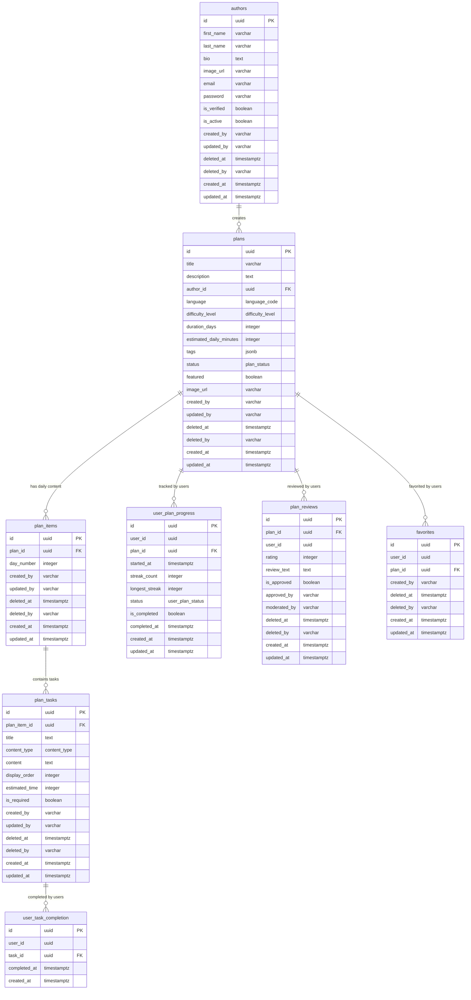

# Database Relationship Diagram

## mermaid live editor
https://mermaid.live/

## Entity Relationship Diagram

## Key Relationships

### **Core Content Hierarchy**
- **plans** → **plan_items** → **plan_tasks**
  - One plan has multiple daily items (plan_items)
  - Each daily item contains multiple tasks (plan_tasks)

### **Authorship**
- **authors** → **plans**
  - Each plan is created by one author
  - Authors can create multiple plans

### **User Engagement**
- **user_plan_progress**: Tracks overall user progress through plans
- **user_task_completion**: Granular tracking of individual task completions
- **plan_reviews**: User ratings and feedback on plans
- **favorites**: User's bookmarked/favorite plans

### **Data Integrity Features**
- **Soft Delete**: Most tables support soft deletion with `deleted_at` and `deleted_by` fields
- **Audit Trail**: All tables track `created_by`, `updated_by` for accountability
- **Unique Constraints**: 
  - One review per user per plan
  - One progress record per user per plan
  - One completion record per user per task
  - Unique day numbers within each plan

### **Performance Optimizations**
- **GIN Indexes**: For JSONB tags and full-text search
- **Partial Indexes**: For featured plans and approved reviews
- **Composite Indexes**: For common query patterns (user + status, plan + day, etc.)

## Schema Design Principles

1. **Hierarchical Content Structure**: Plans → Items → Tasks
2. **Flexible Categorization**: JSONB tags instead of rigid categories
3. **Comprehensive Audit Trail**: Track who created/modified/deleted what
4. **Soft Delete Support**: Maintain data integrity while allowing "deletion"
5. **Performance-First Indexing**: Optimized for common query patterns
6. **Multi-language Support**: Built-in language codes for internationalization
