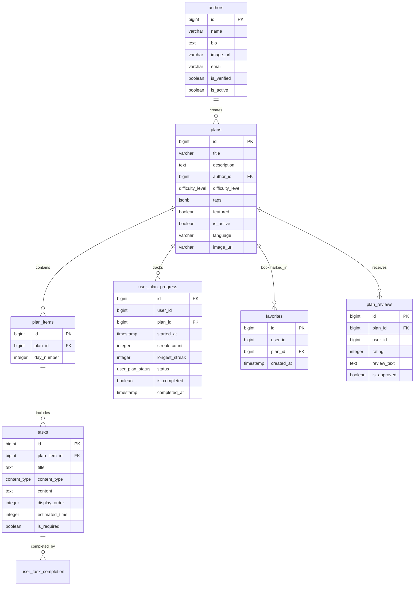
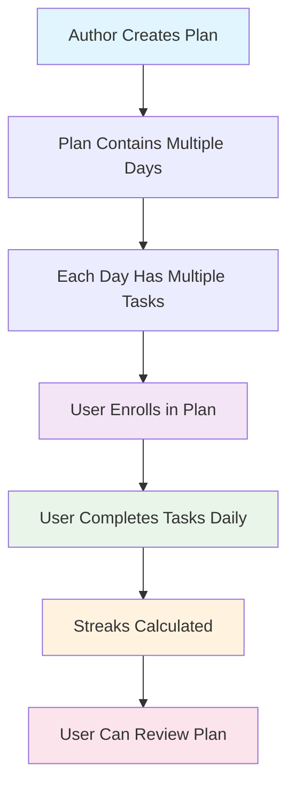
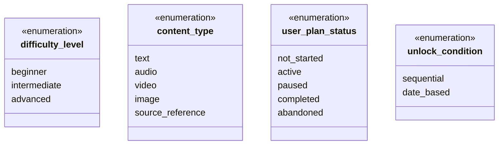

# Buddhist Reading Plans - Visual Database Schema

## ASCII Database Schema Diagram

```
┌─────────────────┐       ┌─────────────────────────────────────┐
│     AUTHORS     │       │               PLANS                 │
├─────────────────┤   1:N ├─────────────────────────────────────┤
│ • id (PK)       │◄──────┤ • id (PK)                           │
│ • name          │       │ • title                             │
│ • bio           │       │ • description                       │
│ • image_url     │       │ • author_id (FK) ──────────────────►│
│ • email         │       │ • difficulty_level (enum)           │
│ • is_verified   │       │ • tags (JSONB)                      │
│ • is_active     │       │ • featured                          │
└─────────────────┘       │ • is_active                         │
                          │ • language                          │
                          │ • image_url                         │
                          └─────────────────────────────────────┘
                                              │
                                              │ 1:N
                                              ▼
                          ┌─────────────────────────────────────┐
                          │            PLAN_ITEMS               │
                          ├─────────────────────────────────────┤
                          │ • id (PK)                           │
                          │ • plan_id (FK) ─────────────────────┤
                          │ • day_number                        │
                          └─────────────────────────────────────┘
                                              │
                                              │ 1:N
                                              ▼
┌─────────────────────────────────────┐   ┌─────────────────────────────────────┐
│              TASKS                  │   │         USER_PLAN_PROGRESS          │
├─────────────────────────────────────┤   ├─────────────────────────────────────┤
│ • id (PK)                           │   │ • id (PK)                           │
│ • plan_item_id (FK) ────────────────┤   │ • user_id                           │
│ • title                             │   │ • plan_id (FK) ─────────────────────┤
│ • content_type (enum)               │   │ • started_at                        │
│ • content                           │   │ • streak_count                      │
│ • display_order                     │   │ • longest_streak                    │
│ • estimated_time                    │   │ • status (enum)                     │
│ • is_required                       │   │ • is_completed                      │
└─────────────────────────────────────┘   │ • completed_at                      │
                                          └─────────────────────────────────────┘

┌─────────────────────────────────────┐   ┌─────────────────────────────────────┐
│             FAVORITES               │   │           PLAN_REVIEWS              │
├─────────────────────────────────────┤   ├─────────────────────────────────────┤
│ • id (PK)                           │   │ • id (PK)                           │
│ • user_id                           │   │ • plan_id (FK) ─────────────────────┤
│ • plan_id (FK)                      │   │ • user_id                           │
│ • created_at                        │   │ • rating (1-5)                      │
└─────────────────────────────────────┘   │ • review_text                       │
                          ▲               │ • is_approved                       │
                          │ N:1           └─────────────────────────────────────┘
                          │                                  ▲
                          └──────────────────────────────────┘
                                     PLANS
```

## Relationship Summary

**Core Content Hierarchy:**
```
AUTHORS (1) ──► PLANS (N) ──► PLAN_ITEMS (N) ──► TASKS (N)
```

**User Interactions:**
```
USERS ──► USER_PLAN_PROGRESS (tracks plan enrollment & streaks)
USERS ──► USER_TASK_COMPLETION (tracks individual task completion)
USERS ──► PLAN_REVIEWS (ratings & feedback)
USERS ──► FAVORITES (bookmarked plans)
```

## Creating Professional Visual Diagrams

###  Code-to-Diagram Tools

**Mermaid Live Editor**
1. Go to https://mermaid.live/
2. Paste the Mermaid code from below
3. Export as PNG or SVG



## Simplified Business Logic Flow



## Key Relationships Explained

### **Core Content Structure**
- **Authors** create **Plans**
- **Plans** contain multiple **Plan Items** (daily content)
- **Plan Items** include multiple **Tasks** (specific activities)

### **User Interaction**
- **Users** enroll in **Plans** (tracked in `user_plan_progress`)
- **Users** complete individual **Tasks** (tracked in `user_task_completion`)
- **Users** can review **Plans** (stored in `plan_reviews`)
- **Users** can favorite **Plans** (stored in `favorites`)

### **Progress Tracking**
- Plan-level engagement: streaks, status, completion flag and timestamp
- Task-level completion: individual task completion timestamps
- Review system: ratings and feedback for plans

## Enum Types Reference



## Business Rules Summary

### **Plan Organization**
- **Simplified Categorization**: `difficulty_level` and flexible `tags`
- **Featured Plans**: Admin-curated plans for homepage promotion
- **Multi-language**: Plans can be created in different languages

### **User Experience**
- **Flexible Enrollment**: Users can have multiple active plans
- **Progress Tracking**: Plan-specific streaks
- **Task Flexibility**: Tasks can be required or optional
- **Review System**: Users can rate and review completed plans
- **Favorites**: Users can bookmark plans

### **Content Management**
- **Author Verification**: Authors can be verified by admins
- **Content Types**: Support for text, audio, video, images, and references
- **Scheduling**: Plans can be sequential or date-based
- **Time Estimation**: Task-level time estimates

## Key Indexes for Performance

- **Plan Discovery**: `(tags, difficulty_level, is_active)`
- **Featured Plans**: `(featured)` where featured = TRUE
- **Full-text Search**: GIN index on plan titles and descriptions
- **Tags Search**: GIN index on JSONB tags field
- **User Progress**: `(user_id, status)` for dashboard queries
- **Task Completion**: `(user_id, task_id)` for progress tracking
